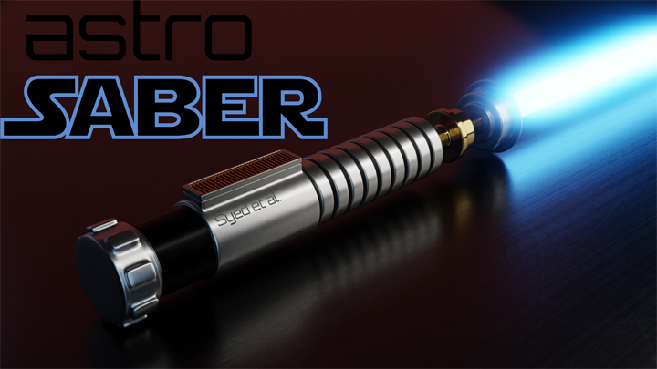

<!--
  Title: astroSABER
  Description: Self-Absorption Baseline ExtractoR developed for systematic baseline smoothing.
  Author: astrojoni89
-->

# astroSABER

  


* **Documentation**: [https://astrojoni89.github.io/astrosaber/](https://astrojoni89.github.io/astrosaber/)
* **Installation**: [see below](#installation)
* **Getting started**: [see below](#getting-started)
* **Citing astroSABER**: [see below](#citing-astrosaber)

## About
The astroSABER (**S**elf-**A**bsorption **B**aseline **E**xtracto**R**) algorithm is an automated baseline extraction routine that is designed to recover baselines of absorption features that are convoluted with HI emission spectra. It utilizes asymmetric least squares smoothing first proposed by [Eilers (2004)](https://pubs.acs.org/doi/10.1021/ac034800e). The algorithm progresses iteratively in two cycles to obtain a smoothed baseline, the major (outer) cycle and the minor (inner) cycle executed at each iteration of the major cycle. The basis of the minor cycle is to find a solution that minimizes the penalized least squares function:


$$\begin{equation}
F(\mathbf{z}) = (\mathbf{y} - \mathbf{z})^\top \mathbf{W} (\mathbf{y} - \mathbf{z}) + \lambda \mathbf{z}^\top \mathbf{D}^\top \mathbf{D} \mathbf{z} ,
\end{equation}$$

where $\mathbf{y}$ is the input signal (e.g., the observed \ion{H}{i} spectrum) and $\mathbf{z}$ is the asymmetrically smoothed baseline to be found. The first and second term describe the fitness of the data and the smoothness of $\mathbf{z}$ defined by the second order differential matrix $\mathbf{D}$, respectively. The parameter $\lambda$ adjusts the weight of the smoothing term. In order to correct the baseline with respect to peaks and dips in the spectrum, the asymmetry weighting matrix $\mathbf{W} = \mathrm{diag}(\mathbf{w})$ is introduced. The asymmetry weights are initialized to be $w_i=1$. After a first iteration of the minor cycle, the weights are then assigned as follows:

$$\begin{align*}
    w_i = \begin{cases}
    p, & y_i > z_i \\
    1-p, & y_i \leq z_i
    \end{cases} .
\end{align*}$$

The asymmetry parameter $p\in[0,1]$ is set to favor either peaks or dips while smoothing the spectra. Given both the parameters $\lambda$ and $p$, a smoothed baseline $\mathbf{z}$ is updated iteratively. Depending on $p$ and the deviation of $\mathbf{z}$ from $\mathbf{y}$ after each iteration, peaks (dips) in the spectrum will be retained while dips (peaks) will be given less weight during the smoothing.

After $n_{\mathrm{minor}}$ iterations, the minor cycle converges, such that the iteratively updated baseline $\mathbf{z}$ will not change anymore given the input spectrum $\mathbf{y}$. However, in order to effectively smooth out dips while still retaining real signal peaks in the spectra, the smoothed baseline $\mathbf{z}$ is then passed to the next iteration of the major cycle as an input (i.e. now $\mathbf{y}$) for its minor cycle smoothing.

In the case of the THOR HI data, the minor cycle has shown to already converge after three iterations. Hence, the number of minor cycle iterations has been fixed at $n_{\mathrm{minor}}=3$ in the algorithm. This parameter affects the output of `astrosaber` only mildly since the final smoothed baseline is mostly dependent on the number of iterations in the major cycle and on the $\lambda$ parameter that tunes the smoothing.

## Installation
### Dependencies
You will need the following packages to run `astrosaber`. We list the version of each package which we know to be compatible with `astrosaber`:

* [python3.6](https://www.python.org/) 
* [astropy (v4.0.2)](https://www.astropy.org/)
* [numpy (v1.19.2)](https://numpy.org/)
* [scipy (v1.5.2)](https://www.scipy.org/)
* [matplotlib (v3.3.4)](https://matplotlib.org/)
* [tqdm (v4.56.2)](https://tqdm.github.io/)

### Download astroSABER
Download `astrosaber` using git `$ git clone https://github.com/astrojoni89/astrosaber.git`

### Installing astroSABER
To install `astrosaber`, make sure that all dependencies are already installed and properly linked to python. We recommend using anaconda and creating a new environment. Then cd to the local directory containing `astrosaber` and install via
```
pip install astrosaber
```
or without using pip
```
python setup.py install
```
from within the `astrosaber` directory.

## Getting started
You can find example scripts and a jupyter notebook for an HI self-absorption (HISA) baseline extraction run in the `example` directory. The data used in this example are taken from The HI/OH Recombination line survey of the inner Milky Way (THOR; [Beuther et al. 2016](https://ui.adsabs.harvard.edu/abs/2016A%26A...595A..32B/abstract), [Wang et al. 2020](https://ui.adsabs.harvard.edu/abs/2020A%26A...634A..83W/abstract)).

## Citing astroSABER
If you make use of this package in a publication, please consider the following citation:

```
@ARTICLE{2023arXiv231002077S,
       author = {{Syed}, J. and {Beuther}, H. and {Goldsmith}, P.~F. and {Henning}, Th. and {Heyer}, M. and {Klessen}, R.~S. and {Stil}, J.~M. and {Soler}, J.~D. and {Anderson}, L.~D. and {Urquhart}, J.~S. and {Rugel}, M.~R. and {Johnston}, K.~G. and {Brunthaler}, A.},
        title = "{Cold atomic gas identified by HI self-absorption. Cold atomic clouds toward giant molecular filaments}",
      journal = {arXiv e-prints},
     keywords = {Astrophysics - Astrophysics of Galaxies},
         year = 2023,
        month = oct,
          eid = {arXiv:2310.02077},
        pages = {arXiv:2310.02077},
          doi = {10.48550/arXiv.2310.02077},
archivePrefix = {arXiv},
       eprint = {2310.02077},
 primaryClass = {astro-ph.GA},
       adsurl = {https://ui.adsabs.harvard.edu/abs/2023arXiv231002077S},
      adsnote = {Provided by the SAO/NASA Astrophysics Data System}
}

```
Citation courtesy of [ADS](https://ui.adsabs.harvard.edu/#).

Please also consider acknowledgements to the required packages in your work.

## Feedback
We would love to get your feedback on `astrosaber`. If you should find that `astrosaber` does not perform as intended for your dataset or if you should come across bugs or have suggestions for improvement, please get into contact with us or open a new Issue or Pull request.

